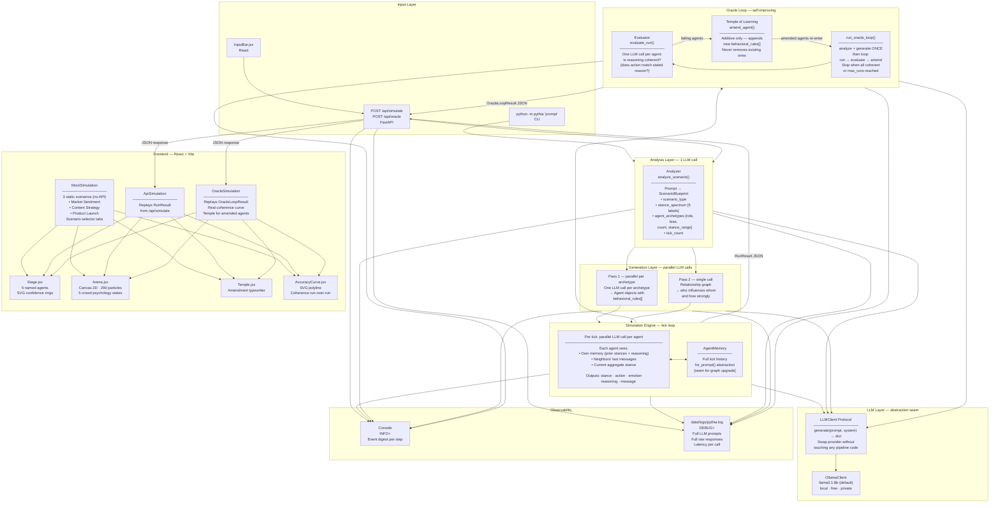

# Pythia — Architecture

> Renders in GitHub, VS Code (Mermaid preview), or any Markdown viewer with Mermaid support.

---

## System Diagram

---

## Decision Log

Every non-obvious choice made and why.

| Component | Decision | Why |
|---|---|---|
| **Analyzer** | Single LLM call: plain English → typed blueprint | Avoids asking users to fill a form. One structured call is reliable enough with small models. |
| **Generator Pass 1** | Parallel per archetype | Archetypes are independent — no reason to serialize. Parallel cuts generation time by N×. |
| **Generator Pass 2** | Separate relationship call after all agents exist | Relationships need all agent IDs. Can't be done in Pass 1 because agents don't know each other yet. |
| **behavioral_rules[]** | Array of strings quoted into every agent prompt | Lets agents "remember who they are" across ticks without a vector DB. Simple and effective for 20 ticks. |
| **SimulationEngine** | Parallel LLM calls per tick | All agents reason simultaneously — eliminates turn-order bias. Agents see last tick's world state, not this tick's in-progress updates. |
| **AgentMemory.for_prompt()** | Only access point to agent history | Deliberate seam. Today: raw concatenation. Future: compression or graph summary — without touching engine. |
| **Coherence not accuracy** | Evaluator grades reasoning consistency, not archetype conformity | No ground truth available. Coherence = "did stated reasoning explain the action?" — measurable without external data. |
| **Additive amendments** | Temple appends rules, never removes | Removal causes agents to drift toward generic behavior. Addition accumulates nuance run over run. |
| **analyze + generate once** | Oracle loop re-uses blueprint and agents across runs | Agents carry learned rules forward. Re-analyzing would discard what was learned. |
| **Static demo scenarios** | 3 hardcoded scenarios in scenarios.js | Works without Ollama. Needed for: gif recording, first-load UX, demos on machines with no GPU. |
| **Custom engine** | No OASIS/CAMEL-AI | OASIS is social-media focused. Opinion dynamics model is simpler, more flexible, and fully owned. |
| **Ollama (local)** | No cloud LLM by default | Zero API costs during development. Swappable via LLMClient Protocol without touching pipeline. |
| **LLMClient Protocol** | Python Protocol (structural typing) | Any object with `generate(prompt, system) → dict` works. No inheritance required. |
| **5 protagonists + 290 particles** | Named agents + crowd field | 1000 named agents can't be individually rendered. Crowd psychology governs the mass; protagonists are the characters you follow. |
| **JSON structured output** | Each agent tick returns `{stance, action, emotion, reasoning, message}` | Reliable with small models. Maps cleanly to UI. Machine-readable for evaluation and amendment. |
| **Console INFO + file DEBUG** | Two-tier logging | Console stays readable during a run. File gets full LLM prompts + raw responses for forensic debugging. |

---

## What's Built (Phase Status)

| Phase | What | Status |
|---|---|---|
| Phase 1 | Simulation backbone — analyzer, generator, engine, orchestrator, API, CLI | ✅ Complete |
| Phase 2 | Oracle loop — evaluator, temple, oracle_loop, UI coherence curve | ✅ Complete |
| Phase 3 | Frontend — React SPA, 3 demo scenarios, scenario selector | ✅ Complete |
| Phase 4 | Launch — Docker, README gif, GitHub launch | 🔲 Next |

---

## Planned Extensions

### Per-Agent Model Routing (Phase 4)

Each agent archetype can specify its own LLM provider + model. Useful for:
- Fast/cheap models for reactive agents (llama3.2:3b)
- Precise models for analytical agents (claude-sonnet)

**What to add:**
1. `model: str | None` field on `AgentArchetype` in `models.py`
2. `OpenAIClient` and `AnthropicClient` implementing `LLMClient` Protocol
3. Router in engine: pick client based on agent's archetype model field, fall back to global

**Security:**
- API keys via env vars only (`ANTHROPIC_API_KEY`, `OPENAI_API_KEY`)
- Keys live on the server — never in API responses or frontend

**Files:** `models.py` (+1 field), `openai_client.py` (new), `anthropic_client.py` (new), `engine.py` (~10 lines)

### God's Eye View (Phase 5)
Inject a new variable mid-simulation via the UI. Engine pauses, injects context into all agent prompts for the next tick, resumes.

### Cross-Simulation Research DAG (Phase 5)
Behavioral patterns learned in one simulation seed hypotheses in the next. Lineage graph tracks which amendments propagated across domains.
